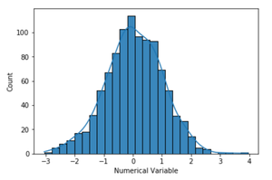
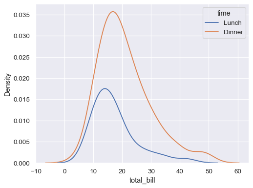
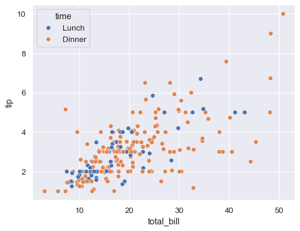
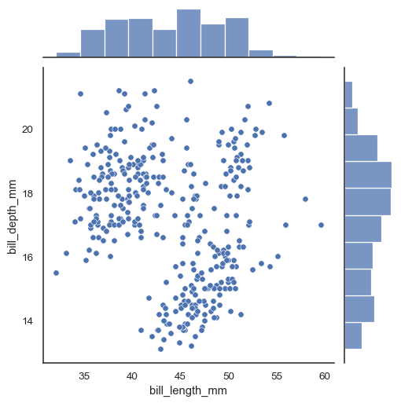
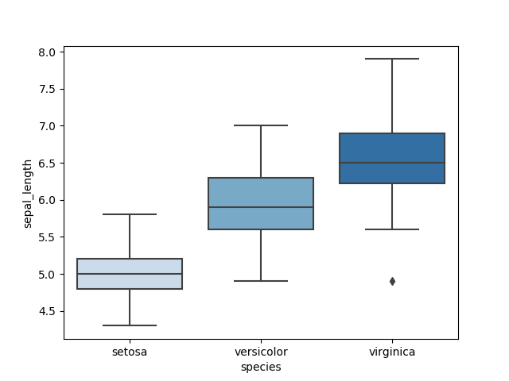
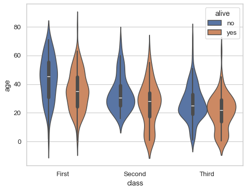
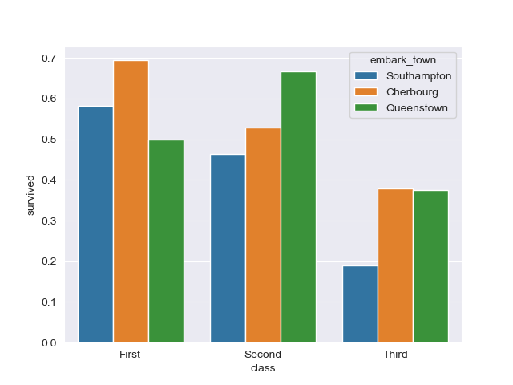
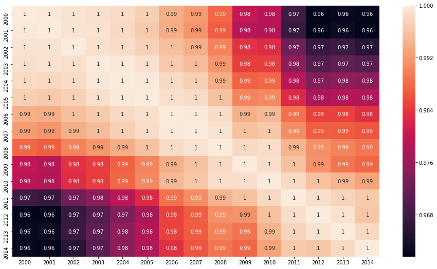

# Datenvisualisierung mit Seaborn

## Installation von Seaborn
```bash
pip install seaborn
```

Importieren von Seaborn und Datenladen

```python
import seaborn as sns
import matplotlib.pyplot as plt
import pandas as pd
```

## Univariate Diagramme

### Histogramm

```python
sns.histplot(data['Spalte'])
plt.show()
```



### Kernverteilungsschätzung (KDE)

```python
sns.kdeplot(data['Spalte'], shade=True)
plt.show()
```


## Bivariate Diagramme

### Streudiagramm (Scatter Plot)

```python
sns.scatterplot(x='Spalte1', y='Spalte2', data=data)
plt.show()
```



### Joint Plot für bivariate Analysen

```python
sns.jointplot(x='Spalte1', y='Spalte2', data=data, kind='scatter')
plt.show()
```


## Kategorische Diagramme

### Boxplot

```python
sns.boxplot(x='Kategorie', y='Wert', data=data)
plt.show()
```


### Violinplot

```python
sns.violinplot(x='Kategorie', y='Wert', data=data)
plt.show()
```


### Balkendiagramm (Bar Plot)

```python
sns.barplot(x='Kategorie', y='Wert', data=data)
plt.show()
```


## Matrix-Diagramme

### Heatmap für Korrelationsmatrizen

```python
correlation_matrix = data.corr()
sns.heatmap(correlation_matrix, annot=True, cmap='coolwarm')
plt.show()
```

